# 🚀 AI-Powered Smart Productivity Planner


An intelligent productivity management platform designed to help students and professionals plan tasks, break down complex goals, track progress, and stay focused using AI-powered assistance.

The system combines task management, smart scheduling, productivity analytics, focus tools, and AI-generated task breakdowns to transform overwhelming goals into structured and actionable plans.

---

## 🌐 Live Application

https://smart-productivity-planner-five.vercel.app/

---

## ✨ Key Features

### 🤖 AI-Powered Productivity

* AI Task Breakdown
* Automatic Subtask Generation
* Smart Work Planning
* AI-Based Task Structuring
* Goal-Oriented Workflow Management

### 📋 Task Management

* Create, Update & Delete Tasks
* Priority Levels
* Categories & Tags
* Due Dates & Deadlines
* Progress Tracking
* Drag & Drop Task Organization

### 📈 Productivity Analytics

* Productivity Dashboard
* Completion Statistics
* Daily Activity Tracking
* Progress Visualization
* Productivity Heatmaps
* Performance Insights

### 🎯 Focus & Planning

* Pomodoro Timer
* Focus Sessions
* Smart Study Planning
* Academic Task Management
* Semester Planning Support

### 🔐 Authentication & Security

* Secure User Authentication
* Session Persistence
* Protected Routes
* Row Level Security (RLS)
* User-Specific Data Isolation

### 📱 User Experience

* Fully Responsive Design
* Modern Dark UI
* Smooth Animations
* Real-Time Feedback
* Toast Notifications
* Offline-Friendly Experience

---

## 🛠️ Tech Stack

### Frontend


### Backend & Database

* Supabase
* PostgreSQL
* Row Level Security (RLS)
* Database Triggers
* Edge Functions

### AI Integration

* Google Gemini API
* AI Task Breakdown Engine
* Intelligent Subtask Generation

### State & Utilities

* React Hooks
* TypeScript
* React Router
* Local Storage
* Date Management Utilities

### Deployment

* Vercel
* Supabase Cloud

---

## 🏗️ System Architecture

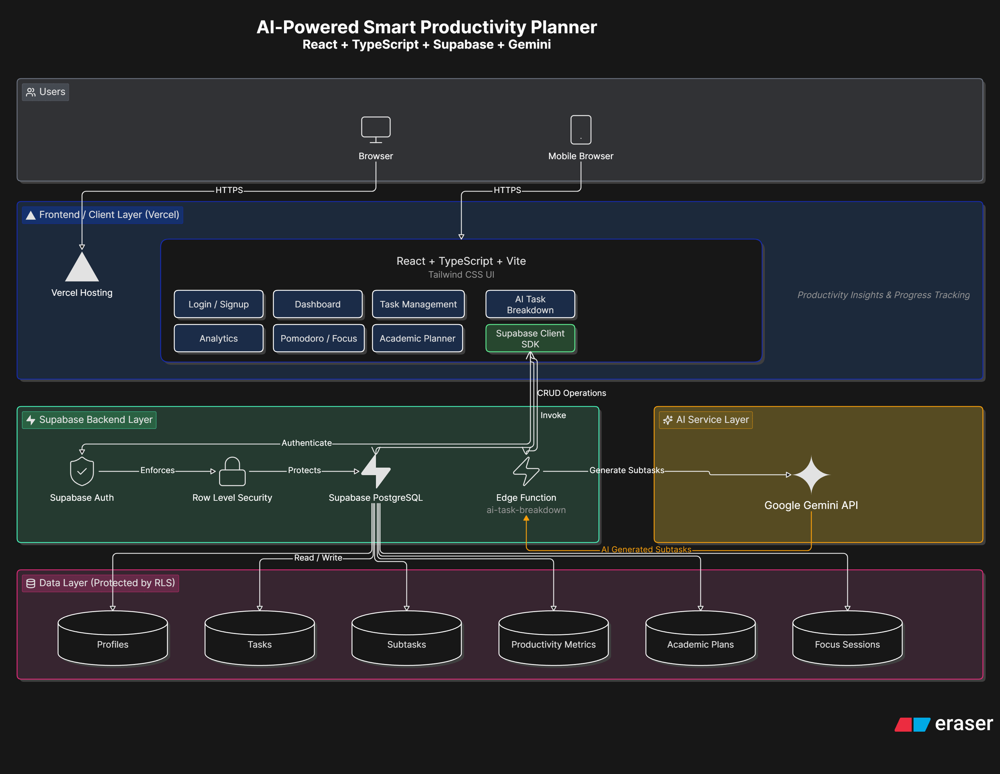

---

## 📸 Screenshots

### Login & Authentication

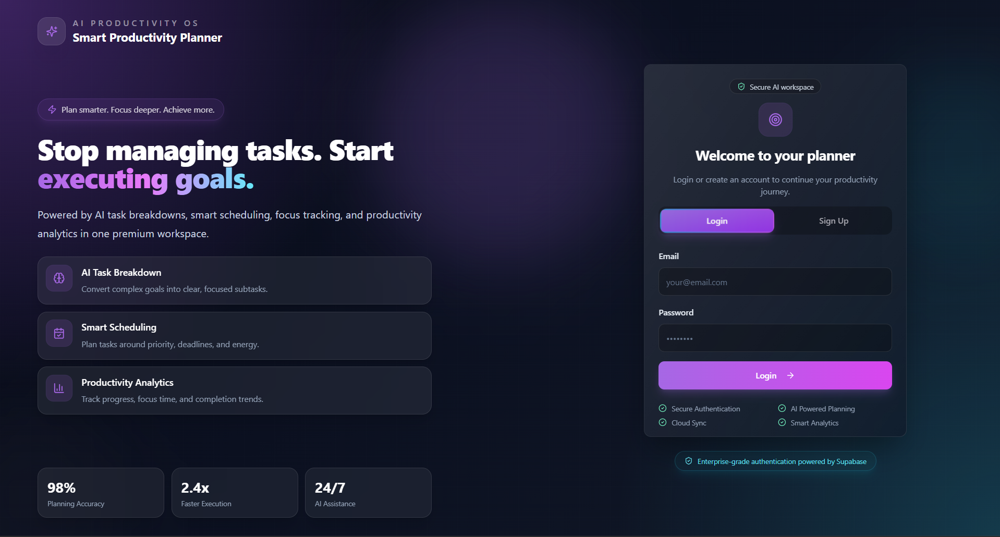

---

### Dashboard

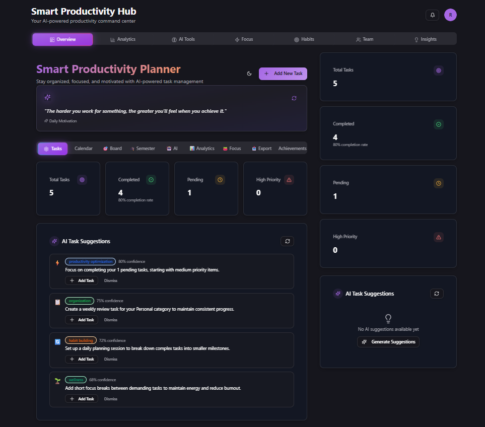

---

### AI Task Breakdown

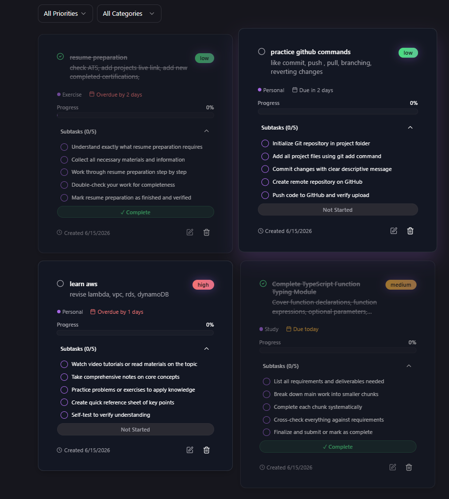

---

### Productivity Analytics

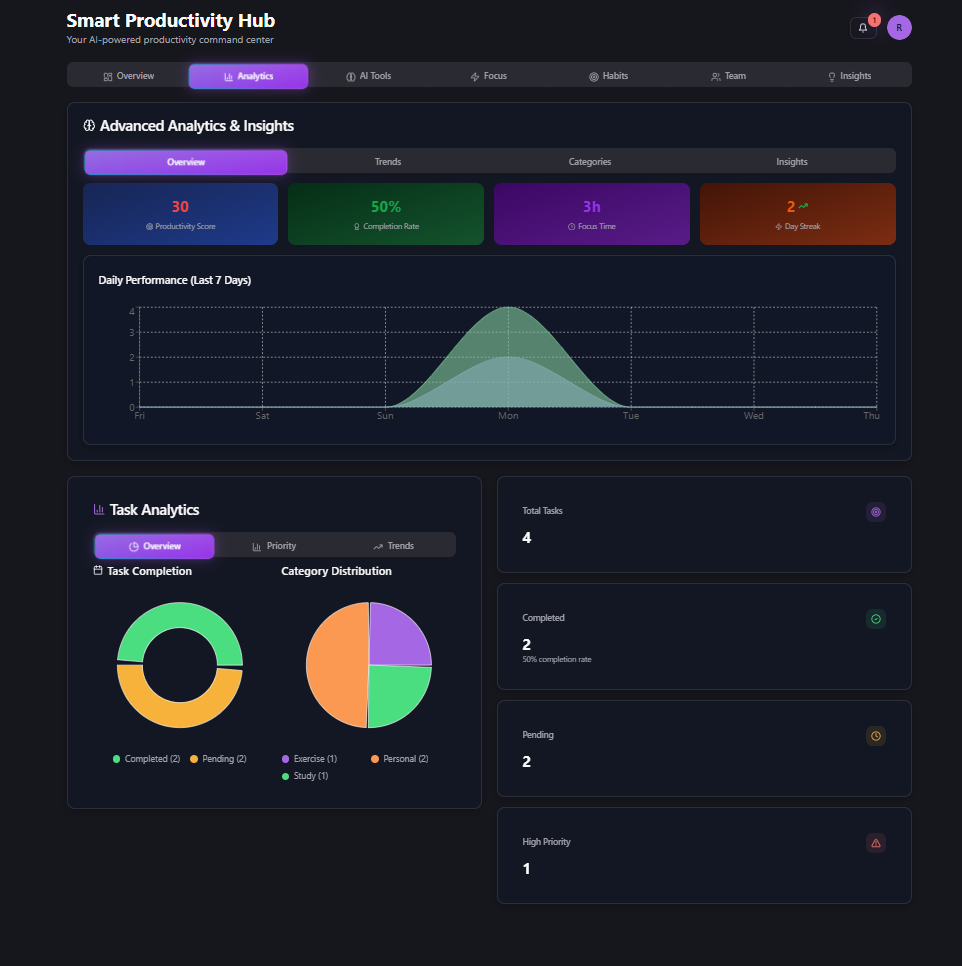
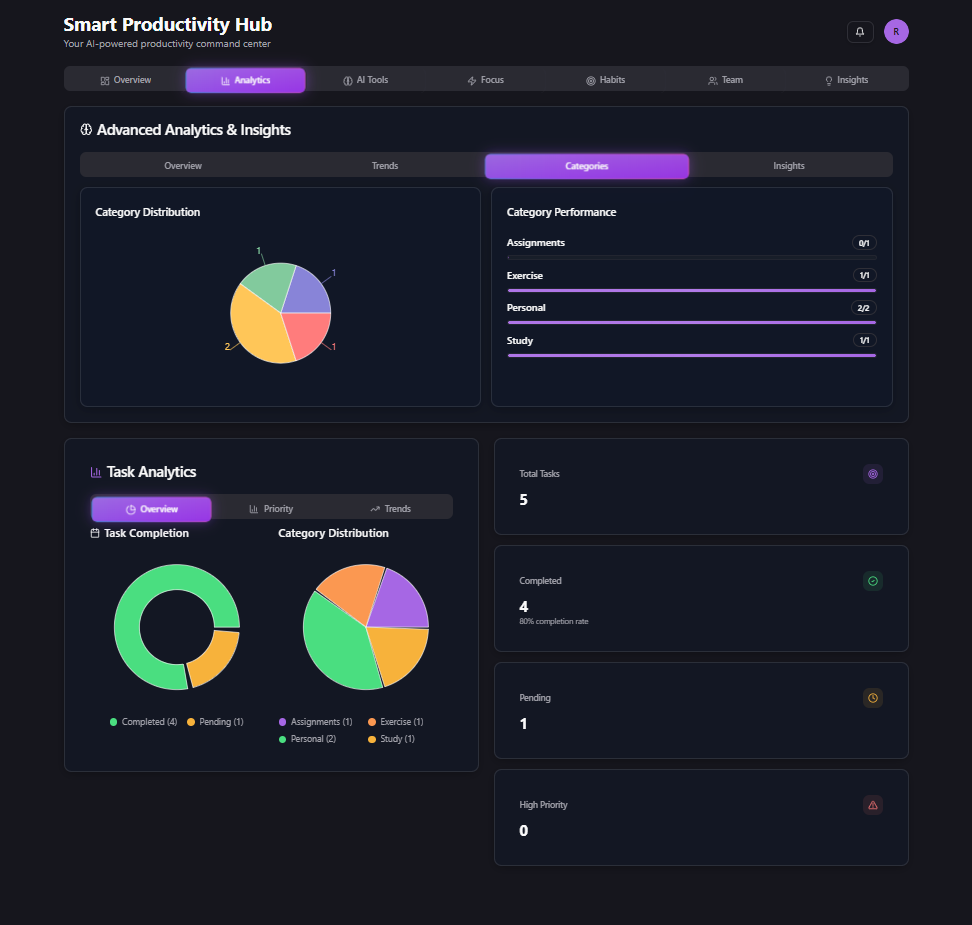

---

### Pomodoro Timer

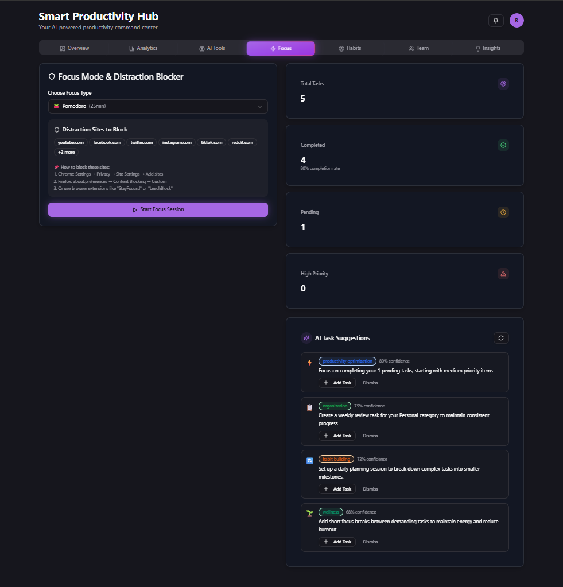

---

### Calendar & Planning

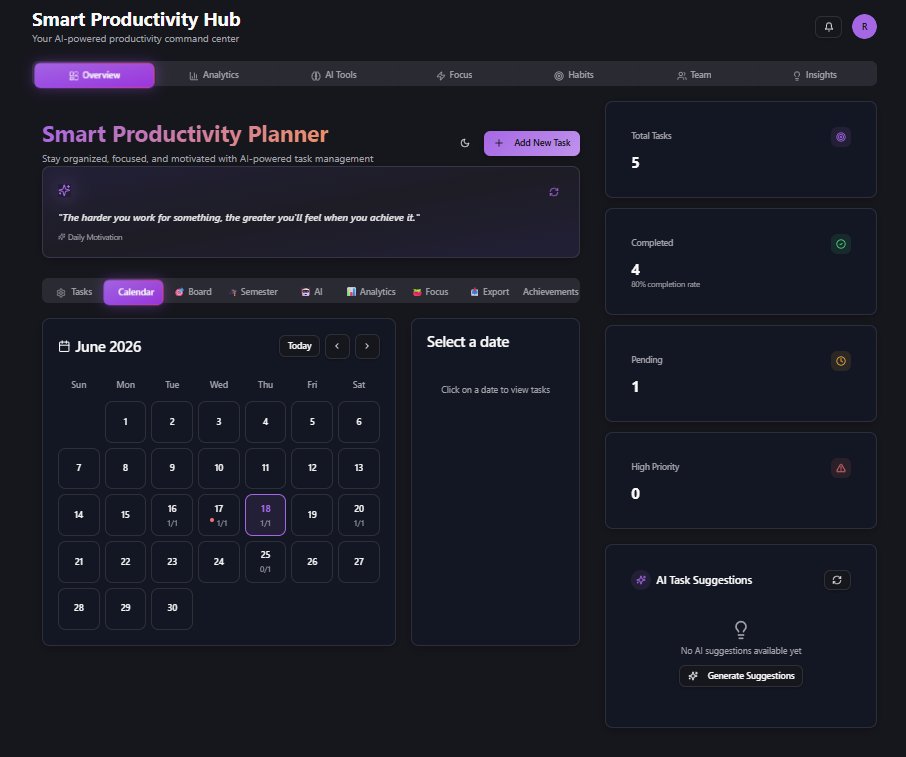

---

### Documents export

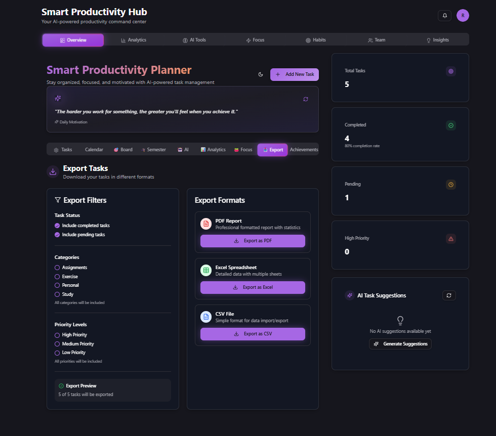

---

### Achievement Tracker

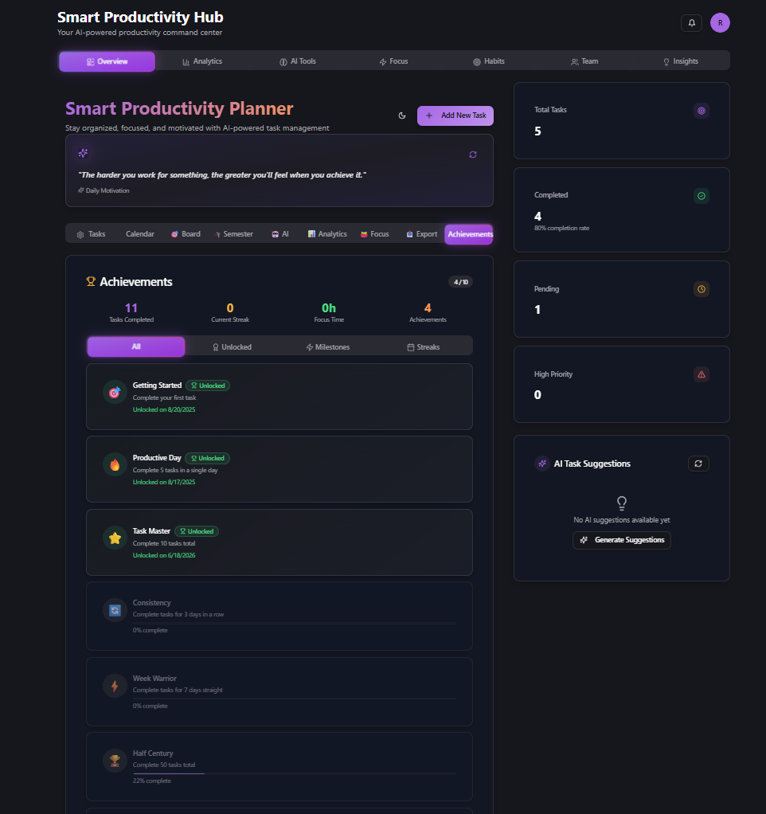

---

## 🧠 AI Workflow

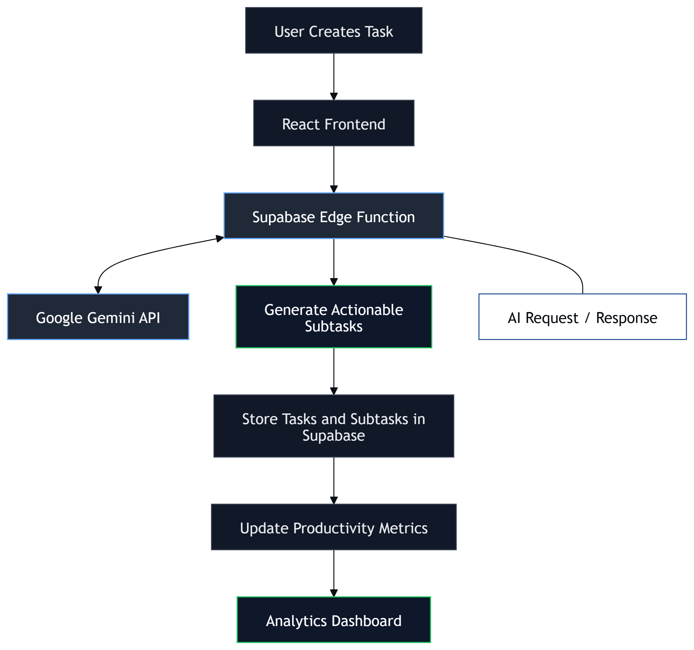

---

## 🔌 Core Modules

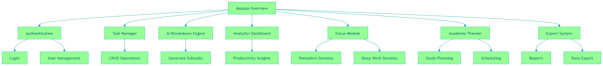

---

## 📂 Project Structure

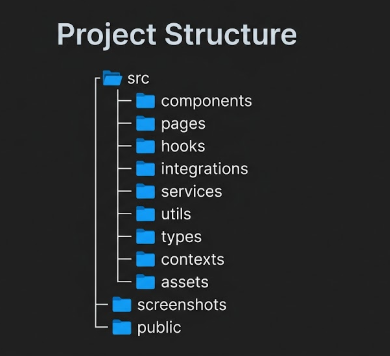


---

## ☁️ Deployment

* Frontend: Vercel
* Backend Services: Supabase
* Database: PostgreSQL (Supabase)
* AI Integration: Google Gemini API

---

## 📊 Key Highlights

* AI-generated task breakdowns
* Secure cloud-based architecture
* Real-time productivity tracking
* Academic and professional planning
* Responsive modern SaaS interface
* Production deployment using Vercel & Supabase

---

## 🔮 Future Enhancements

* AI Smart Scheduling
* Google Calendar Integration
* Team Collaboration
* Real-Time Shared Workspaces
* Habit Tracking System
* AI Productivity Coach
* Focus Website Blocker
* Mobile Application
* Voice-Based Task Creation

---

## ⚙️ Local Setup

### 1. Clone Repository

```bash
git clone https://github.com/Ashutosh-Choubey27/AI-Powered-Smart-Productivity-Planner.git
```

### 2. Install Dependencies

```bash
npm install
```

### 3. Configure Environment Variables

Create `.env` file:

```env
VITE_SUPABASE_URL=your_supabase_url

VITE_SUPABASE_ANON_KEY=your_supabase_anon_key

```

### 4. Run Project

```bash
npm run dev
```

Application will start at:

```text
http://localhost:5173
```

---

## 🔒 Database Security

* Row Level Security (RLS)
* User-Specific Data Access
* Protected Authentication Flows
* Secure Session Management

---

## 🎯 Use Cases

### Students

* Semester Planning
* Exam Preparation
* Assignment Tracking
* Study Scheduling

### Professionals

* Daily Task Planning
* Goal Management
* Productivity Monitoring
* Work Prioritization

### Freelancers

* Project Tracking
* Client Deliverables
* Deadline Management
* Workload Planning

---

## 👨‍💻 Author

**Ashutosh Choubey**

MCA Student | Full Stack Developer | React | TypeScript | AI-Powered Web Applications

---

## ⭐ Support

If you found this project useful, consider giving it a star on GitHub.
It helps the project reach more developers and motivates future improvements.
